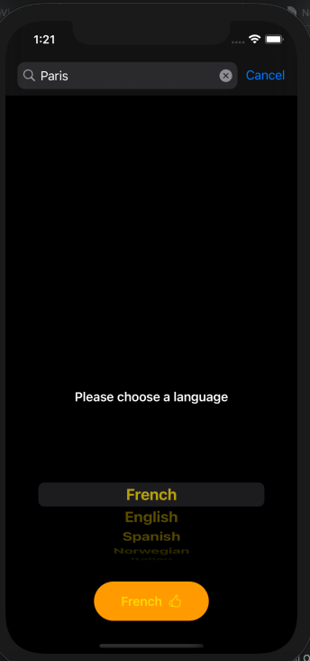
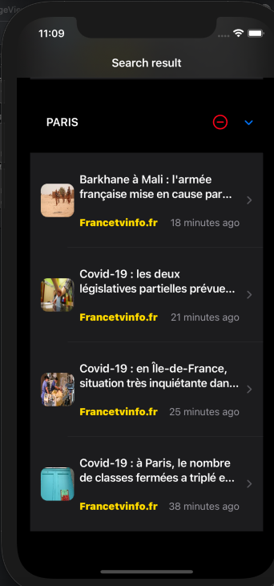
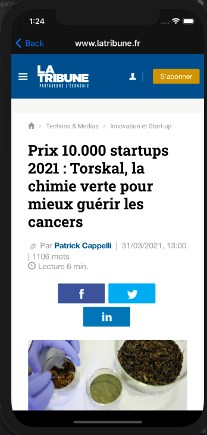

# PYN a news app

PYN is an IOS app which provides to the user a customized news.<br/> The user provides keywords and then the app displays a filtered news.<br/>
This is a personal project and the goal was to practice my IOS development skill.
<br><br>


<br/>


## Technologies

The project is created with:<br/>

* Xcode version: 12.4
* Swift version: 5
* Git version: 2.31
* SwiftUI
* Combine
* URLSession
* FileManager
* NSCache

## Setup

To run this project, you need to create an account at the news provider website [News Api](https://newsapi.org).<br/>
Use the provided API KEY, this way:

```
extension URL{
 static let apiKey = "Write-Your-Api-Key-Here"
}
```

## Features

* Ability to get your news in five different languages.
* Storing the news list on the phone.
* Uploading the user´s news when the app moves to foreground.
* The app is automatically updating the news list once every hour.

## License

MIT

Email: awaleh_h@yahoo.com
@Livestonge
